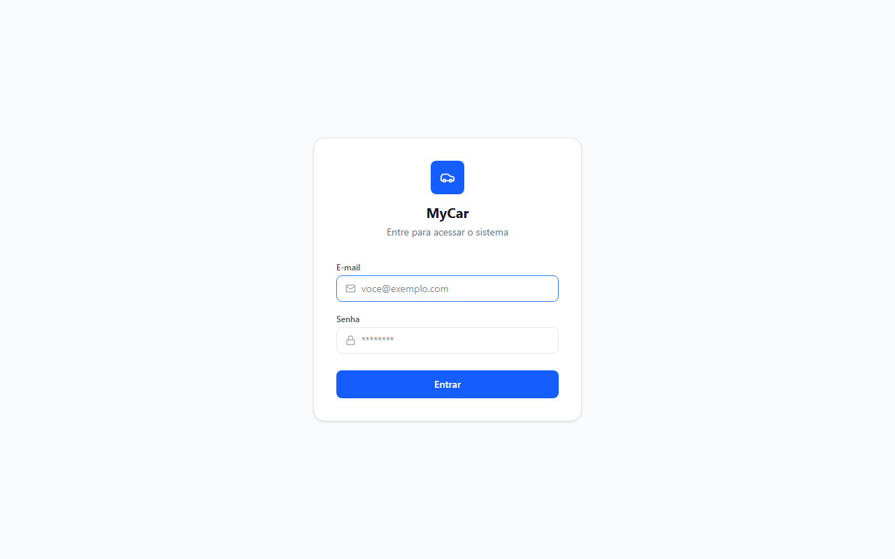
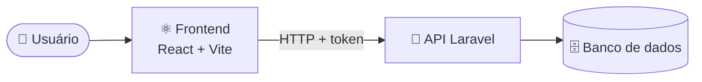
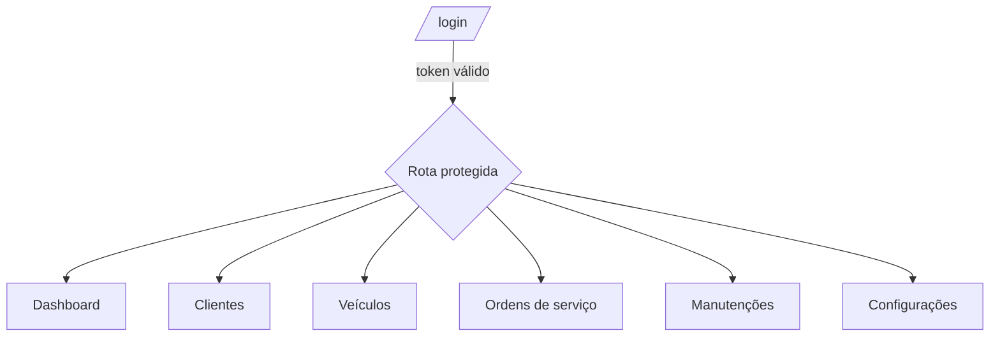

<div align="center">

# 🚗 MyCar

### Sistema de gestão para oficina mecânica

Controle clientes, veículos, ordens de serviço e manutenções em um só lugar.


**Frontend** · [Ver API (Laravel)](https://github.com/joaoalexandre2/mycar)

</div>

<div align="center">
  
</div>

---

## ✨ Funcionalidades

| | |
|---|---|
| 🔐 **Login** | Autenticação por token e rotas protegidas |
| 📊 **Dashboard** | Resumo geral da oficina |
| 👥 **Clientes** | Cadastro, edição e busca com paginação |
| 🚙 **Veículos** | Veículos vinculados a cada cliente |
| 🧾 **Ordens de serviço** | Abertura, acompanhamento e fechamento |
| 🔧 **Manutenções** | Histórico e próximas revisões |
| ⚙️ **Configurações** | Ajustes da conta |

## 🧩 Como funciona





## 🚀 Começando

### Pré-requisitos

- Node.js 20+
- [API MyCar](https://github.com/joaoalexandre2/mycar) rodando (padrão: `http://localhost:8000`)

### Instalação

```bash
git clone https://github.com/joaoalexandre2/mycar_frontend.git
cd mycar_frontend
npm install
```

Crie um arquivo `.env` na raiz:

```env
VITE_API_URL=http://localhost:8000/api
```

> Se `VITE_API_URL` não for definida, o padrão é `http://localhost:8000/api`.

### Executando

```bash
npm run dev
```

## 📜 Scripts

| Comando | O que faz |
|---|---|
| `npm run dev` | Servidor de desenvolvimento |
| `npm run build` | Checagem de tipos + build de produção |
| `npm run preview` | Pré-visualiza o build |
| `npm run lint` | Roda o ESLint |
| `npm test` | Roda os testes uma vez |
| `npm run test:watch` | Testes em modo watch |

## 🗺️ Rotas

| Rota | Tela |
|---|---|
| `/login` | Login |
| `/` | Dashboard |
| `/clientes` | Clientes |
| `/veiculos` | Veículos |
| `/ordens-servico` | Ordens de serviço |
| `/manutencoes` | Manutenções |
| `/configuracoes` | Configurações |

## 📁 Estrutura

```
src/
├── components/   # auth, dashboard e layout
├── contexts/     # AuthContext
├── hooks/        # useAuth
├── pages/        # telas da aplicação
├── services/     # chamadas à API (axios)
├── types/        # tipos TypeScript
└── utils/
```

## 🔗 Backend

A API está em [joaoalexandre2/mycar](https://github.com/joaoalexandre2/mycar).

---

<div align="center">
Feito com ☕ por <a href="https://github.com/joaoalexandre2">João Alexandre</a>
</div>
